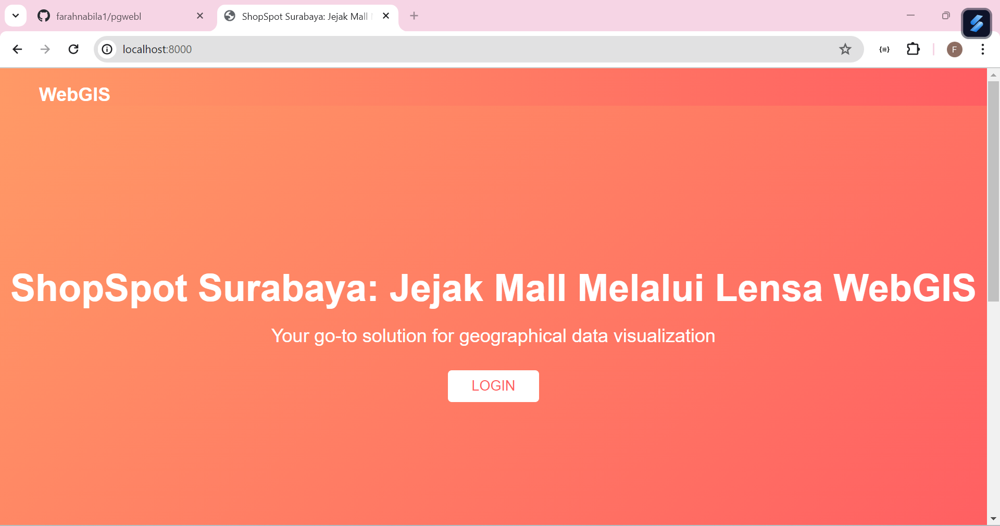
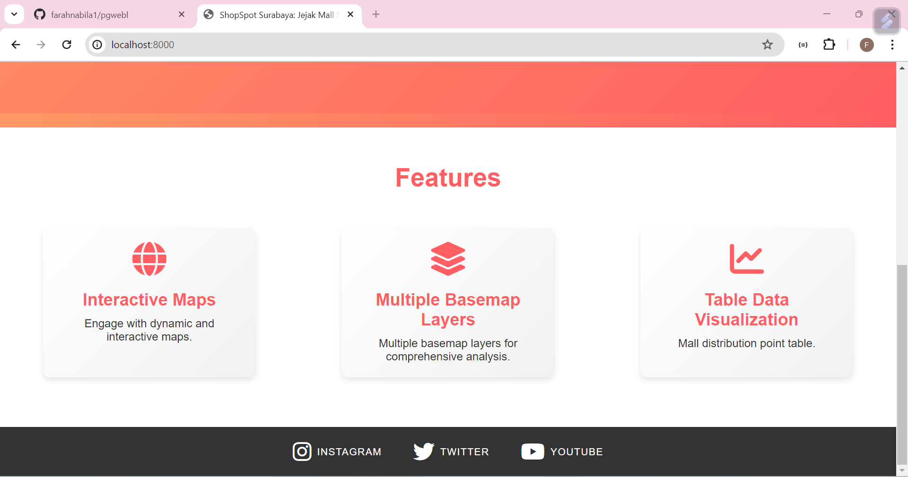
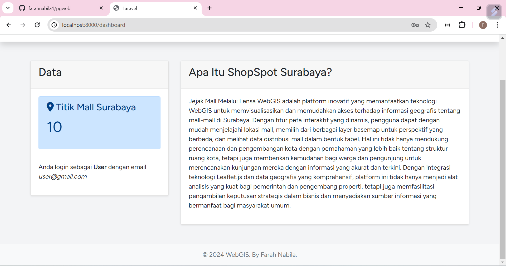
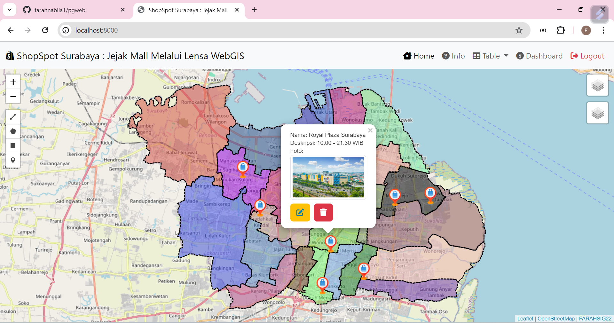
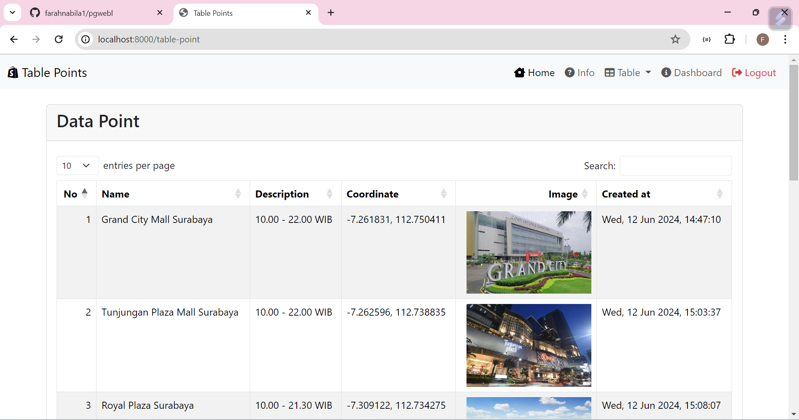
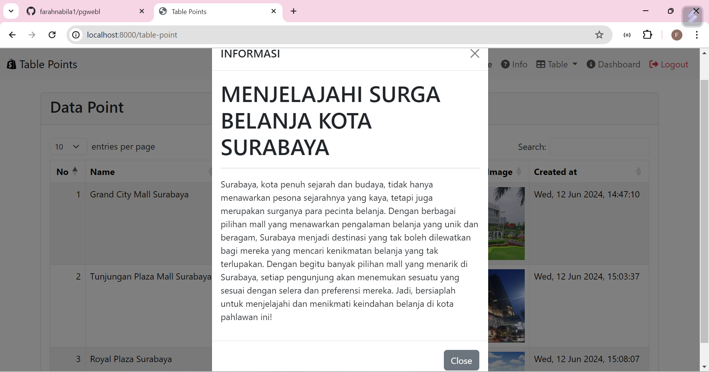

# ShopSpot Surabaya : Jejak Mall Melalui Lensa WebGIS
## Deskripsi Project
**ShopSpot Surabaya : Jejak Mall Melalui Lensa WebGIS** Jejak Mall Melalui Lensa WebGIS adalah platform inovatif yang memanfaatkan teknologi WebGIS untuk memvisualisasikan dan memudahkan akses terhadap informasi geografis tentang mall-mall di Surabaya. Dengan fitur peta interaktif yang dinamis, pengguna dapat dengan mudah menjelajahi lokasi mall, memilih dari berbagai layer basemap untuk perspektif yang berbeda, dan melihat data distribusi mall dalam bentuk tabel. Hal ini tidak hanya mendukung perencanaan dan pengembangan kota dengan pemahaman yang lebih baik tentang struktur ruang kota, tetapi juga memberikan kemudahan bagi warga dan pengunjung untuk merencanakan kunjungan mereka dengan informasi yang akurat dan terkini. Dengan integrasi teknologi Leaflet.js dan data geografis yang komprehensif, platform ini tidak hanya menjadi alat analisis yang kuat bagi pemerintah dan pengembang properti, tetapi juga memfasilitasi pengambilan keputusan strategis dalam bisnis dan menyediakan sumber informasi yang bermanfaat bagi masyarakat umum.

## Komponen Pembangun

### 1. Framework Laravel
Framework PHP yang sangat populer untuk membangun aplikasi web, termasuk aplikasi WebGIS.

### 2. Database Management
DBeaver adalah salah satu tools yang bisa digunakan untuk mengelola database, termasuk dalam konteks pengembangan aplikasi WebGIS. 

### 3. QGIS
QGIS adalah aplikasi desktop open-source yang kuat untuk analisis dan visualisasi data geospasial. Dalam konteks Anda, QGIS dapat digunakan untuk mengelola data SHP (Shapefile) dan mengkonversinya ke format GeoJSON.

### 4. Bootstrap
Bootstrap adalah library CSS digunakan untuk membangun tata letak responsif dan UI yang menarik. Dalam konteks WebGIS, Bootstrap digunakan untuk membangun tata letak responsif.

### 5. LeafletJS
LeafletJS adalah pustaka JavaScript open-source yang digunakan untuk membangun aplikasi web peta interaktif. Leaflet menyediakan API yang intuitif untuk menampilkan peta, marker, poligon, dan interaksi pengguna lainnya.

## Sumber Data
**Sumber Data** WebGIS ShopSpot Surabaya ini disusun dengan menggunakan beberapa sumber data yang meliputi :
- Google Maps : Mencari titik lokasi Mall di Kota Surabaya.
- Data Shapefile : Shapefile Batas Administrasi di Kota Surabaya.
- Sosial Media : Instagram, Twitter, dan Youtube

# Tangkapan Layar Komponen Penting
*Landing Page*

*Dashboard*

*Peta Interaktif*

*Tabel Titik Mall*

*Informasi*

